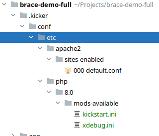
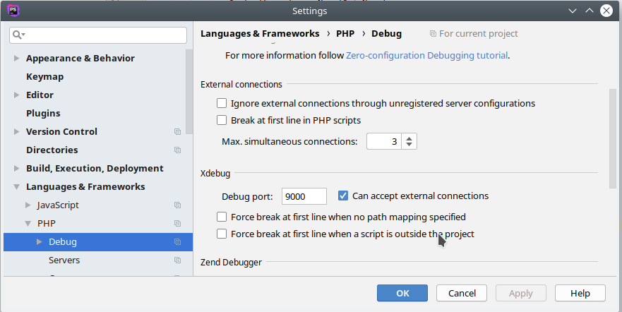
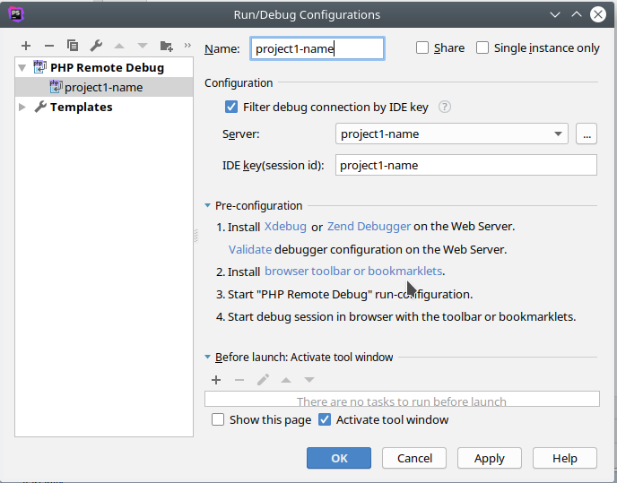
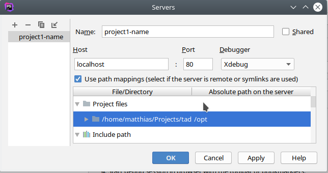
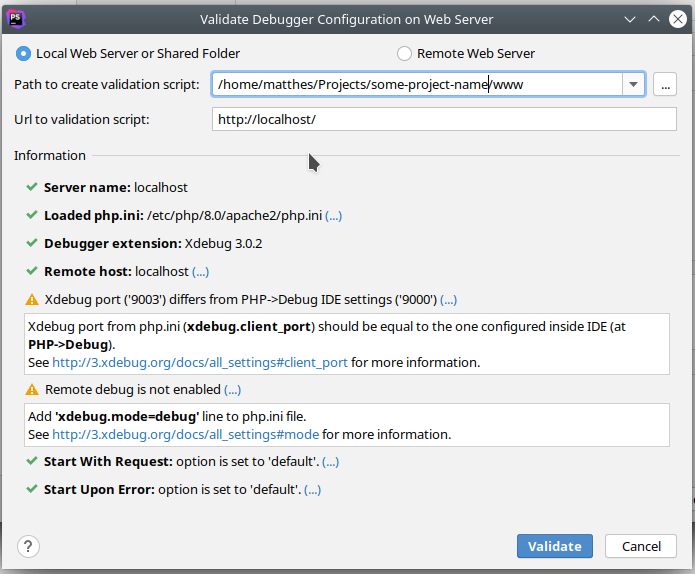

# kickstart-flavor PHP :: Apache2, PHP7, PHP8 development container

[](https://github.com/nfra-project/kickstart-flavor-php/actions)
[](https://github.com/nfra-project/kickstart-flavor-php)

see (http://github.com/infracamp/kickstart) for more information.

Document Index:

- [Development Guide for this flavor](DEVELOPMENT.md)
- [Dockerhub page](https://hub.docker.com/r/nfra/kickstart-flavor-php/)
    - [Tags available](https://hub.docker.com/r/nfra/kickstart-flavor-php/tags/)
    - [Build details](https://hub.docker.com/r/nfra/kickstart-flavor-php/builds/)


## Tags

*Use -min images in Dockerfile and main image in .kick.yml*

| Tag      | OS                          | Branch      | CKit     | Docs                                                                       |
|----------|-----------------------------|-------------|----------|----------------------------------------------------------------------------|
| 7.2      | Ubuntu 18.04 (LTS)          | release/7.2 | 1.4      | [Readme](https://github.com/nfra-project/kickstart-flavor-php/release/7.2) |
| 7.4      | Ubuntu 20.04 (LTS)          | release/7.4 | 1.4      | [Readme](https://github.com/nfra-project/kickstart-flavor-php/release/7.4) |
| 8.0      | Ubuntu 21.10                | release/8.0 | 1.4      | [Readme](https://github.com/nfra-project/kickstart-flavor-php/release/8.0) |
| 8.1      | Ubuntu 22.04                | release/8.1 | 1.4      | [Readme](https://github.com/nfra-project/kickstart-flavor-php/release/8.1) |
| unstable | Ubuntu 22.04 (master), PHP8 | master      | unstable | [Readme](https://github.com/nfra-project/kickstart-flavor-php/)            |


Kickstart uses a fixed version of Ckit to keep the features freeze within
a version.

## Install additional packages

The container comes with no additional Modules pre-installed except xdebug. You might
want to add the following packages to your <kbd>.kick.yml</kbd> `packages:` section to install them.

You'll find all available modules by running `apt update && apt search php8.0`


**Example: Using Curl**
```yaml
packages: [php8.0-curl, php8.0-http, php8.0-raphf]
```


## Default configuration

By default, the document root points to `/opt/www` with a FallbackResource
configured to `/index.php`. You can add specific Options using the `.htaccess`
file.

See [kickstart/conf/](https://github.com/nfra-project/kickstart-flavor-php/tree/master/kickstart/conf/etc) for default configuration. You can
override these by placing the files into `.kicker/conf/` directory of your
project. The configuration will be written each time the container starts.
So you can add specific configuration based on ENV settings.



## Installed Software

Make sure your IDE has plugins installed for:

- **[editorconfig](https://editorconfig.org/#download)** 

### Using the xdebug debugger / profiler with PhpStorm

Xdebug is enabled by default if you are in development mode (the project is run by kickstart.sh)

Xdebug is configured to connect the IDE on the `Docker-Host-IP` (which is the first configured IP of your
host machine - determined by kickstart.sh) on Port `9003`

#### PhpStorm IDE settings (global) 

Activate remote debugging in **Settings**:



#### Project settings

Open *Run* > *Edit configurations...*



**The idekey and serverName is the name of your project!**

Enable Path Mappings:




> **Ensure `serverName`, `idekey` and `configName` is the same of your project name**


#### Start Debugging via browser

To start debugging via browser open:
```
http://localhost/?XDEBUG_SESSION_START=project123-name
```

#### Start CLI debugging

```
just set the breakpoint
```


#### Troubleshooting the debugging

If debugging won't work, use our checklist to determine the cause:

1) Verfiy with PhpStorm Debug validator. (Make sure `Path to validation script` is the
full path to your www-root)



1) Check the docker-host's IP was propagated correctly.
    - The IP should be set as environment-variable `DOCKER_HOST_IP`
    - Inside the container type `echo $DOCKER_HOST_IP` should print your ip
    
    > A) Check kickstart.sh is the newest version (perform ./kickstart.sh --upgrade)
    
    > B) Solution: Check `hostname -i` returns your primary IP address on your
    > host machine.
    
2) Check the IDE is connectable from within the container on Port `9003` (new port since PHP8.0)
    - Install netcat and try the script below:
    ```
    sudo apt install netcat
    nc -zw3 $DOCKER_HOST_IP 9000 && echo "OK: IDE is reachable on port 9003" || echo "ERROR: IDE unreachable"
    ```
    > A) Check if you can reach this PORT from outside the container. If not your IP might be wrong,
    > or your IDE is not correctly configured.    
    
3) Check your IDE-Settings.